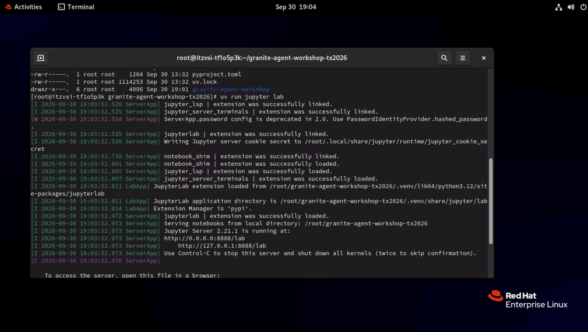
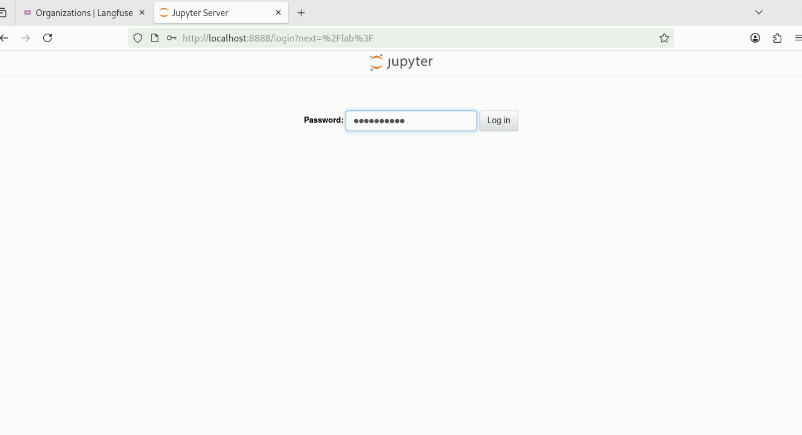

# Getting Started

In this step you clone the workshop repository and open JupyterLab to run the notebooks.

/// note | Using Colab?
Skip this page: Colab opens each notebook directly from GitHub. [Google Colab](https://colab.research.google.com) requires a Google account that you're logged into. Each lab page has an **Open in Colab** link, and the first code cell installs everything the notebook needs. Colab can't read a `.env` file or reach `localhost`, so add your API keys as Colab secrets instead.
///

## Clone the repository

/// tab | Lab workstation

1. Open a terminal and switch to the `root` user:

    ```shell
    sudo su -
    ```

1. Go to the workshop directory and clone the repository:

    ```shell
    cd /root/granite-agent-workshop-tx2026
    git clone --branch tx-26-lab https://github.com/jslecointre/granite-agent-workshop.git
    cd granite-agent-workshop/
    ```

///

/// tab | Your own computer

It is recommended that you have:

- Knowledge of [Git](https://git-scm.com/) and [Python](https://www.python.org/)
- Git
- Python 3.11, 3.12, or 3.13

If not, use [Google Colab](https://colab.research.google.com) instead.

/// tip | Installing Python

If you don't have Python installed, or the installed version is not one of the versions supported by this workshop, you should consider installing and using the [`uv` tool](https://docs.astral.sh/uv/getting-started/installation/) to assist in installing the proper Python version.
`uv` works on macOS, Linux, and Windows.
Once `uv` is installed, you can install Python 3.13 with

```shell
uv python install --default 3.13
```

You can then update the shell configurations files to add the Python commands to the PATH.

```shell
uv python update-shell
```

///

1. Clone the workshop repository on the `tx-26-lab` branch and `cd` into it:

    ```shell
    git clone --branch tx-26-lab https://github.com/jslecointre/granite-agent-workshop.git
    cd granite-agent-workshop
    ```

///

## Open JupyterLab

/// tab | Lab workstation

1. In the browser, open <http://localhost:8888>.

1. If the page doesn't load, JupyterLab isn't running yet. Open a terminal and start it from the workshop directory:

    ```shell
    cd /root/granite-agent-workshop-tx2026
    uv run jupyter lab
    ```

    Wait for the `Jupyter Server ... is running at` message, then reload <http://localhost:8888>. Leave this terminal open: closing it stops JupyterLab.

    

1. On the login page, enter the password `jupyterlab` and click **Log in**.

    

1. In the JupyterLab file browser, open `granite-agent-workshop/notebooks`. The notebooks are numbered in the order you will run them.

1. Open the first notebook and run its first cell to confirm the kernel starts. If it fails, raise your hand now rather than during the first lab.

///

/// tab | Your own computer

/// note | Use a virtual environment
Before installing dependencies and to avoid conflicts in your environment, it is advisable to use a [virtual environment (venv)](https://docs.python.org/3/library/venv.html).
///

From the `granite-agent-workshop` folder you cloned above:

1. Create a virtual environment:

    /// tab | uv

    ```shell
    uv venv --clear --seed --python 3.13 venv
    ```

    ///

    /// tab | venv

    ```shell
    python3 -m venv --upgrade-deps --clear venv
    ```

    ///

1. Activate the virtual environment by running:

    ```shell
    source venv/bin/activate
    ```

1. Install JupyterLab in the virtual environment:

    /// tab | uv

    ```shell
    uv pip install jupyterlab ipywidgets
    ```

    ///

    /// tab | venv

    ```shell
    python3 -m pip install --require-virtualenv jupyterlab ipywidgets
    ```

    ///

    For more information, see the [Jupyter installation instructions](https://jupyter.org/install).

1. Start JupyterLab (in the active virtual environment) and open the `notebooks` folder:

    ```shell
    jupyter lab
    ```

///

Next: [1. Access the Model](../part-01-access-the-model/README.md).
