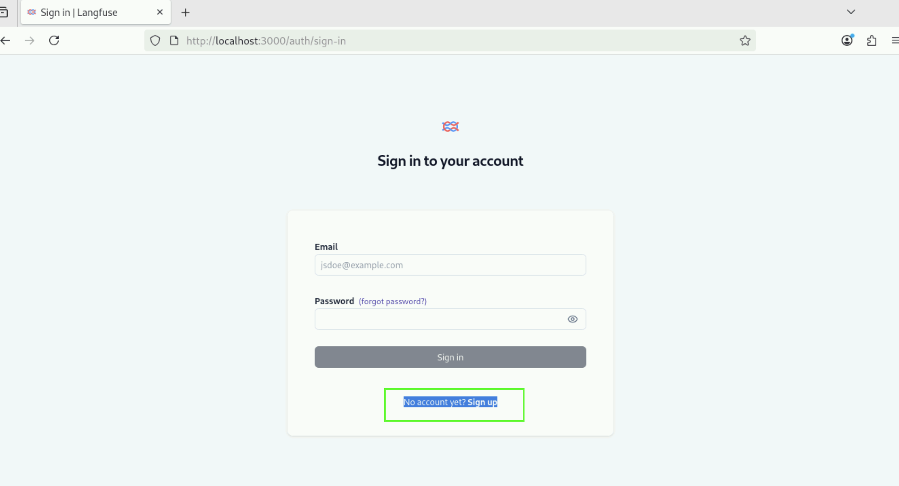
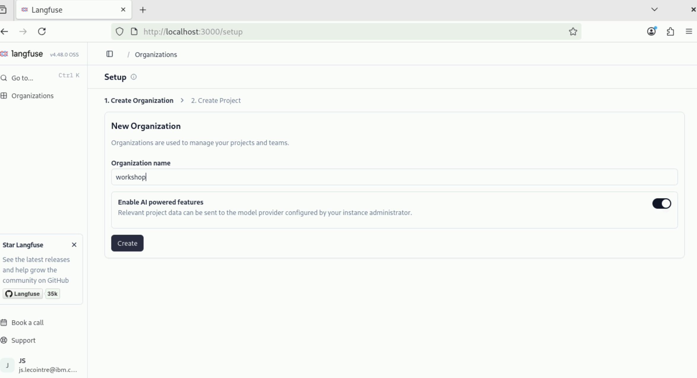
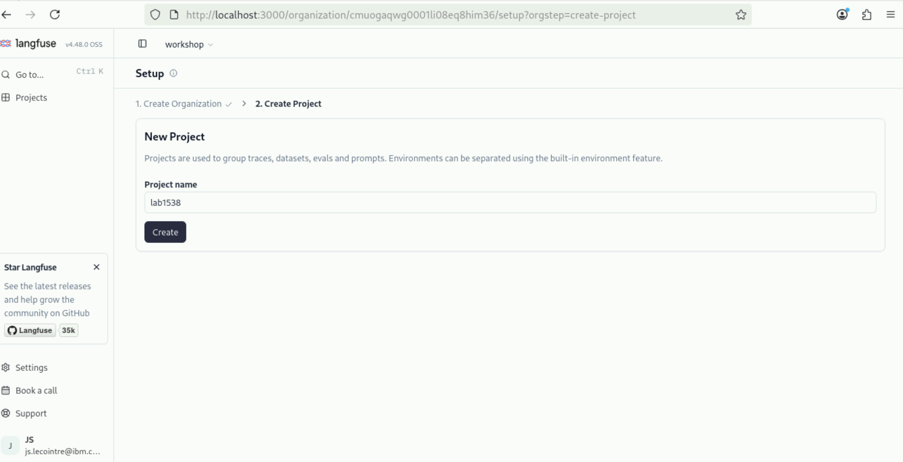
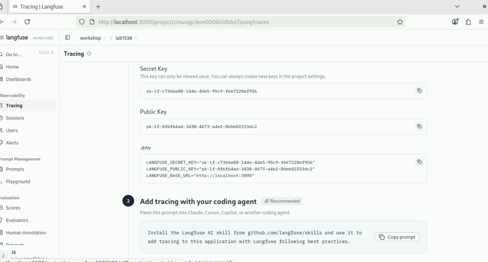
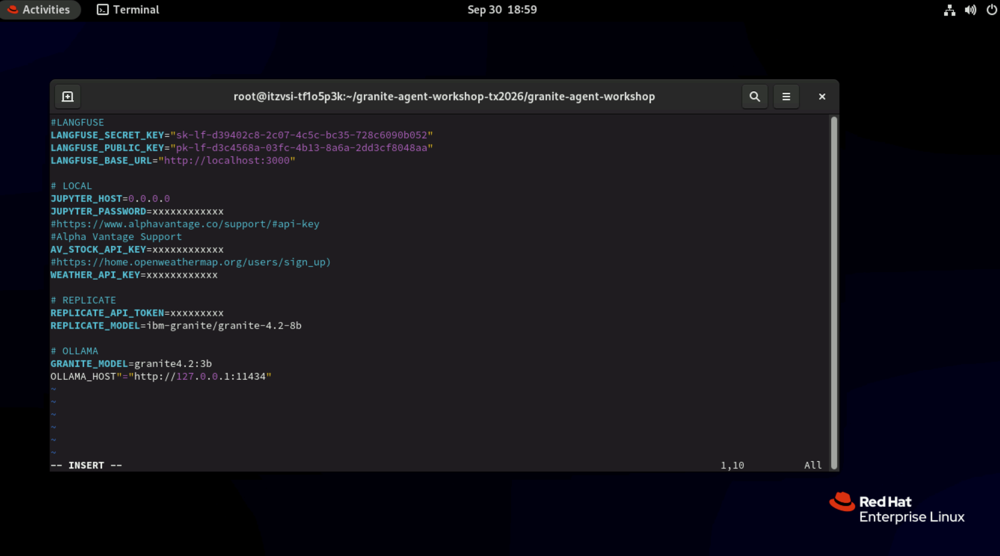

# Agent Observability with Langfuse

Once an agent leaves your notebook, print statements stop being an option. Unlike traditional deterministic software, agentic AI systems produce non-deterministic, multi-step behaviors that shift the operational question from "is it up?" to "is it right?" Observability -- capturing rich telemetry and traceability -- is what lets you answer that question in production.

This lab takes the agent from [2.1 Function Calling Agent](../part-02-building-agents/function-calling.md) (`get_llm()`, `get_stock_price`, `get_current_weather`, `build_agent()`) and instruments it with [Langfuse](https://langfuse.com) tracing. You will:

1. Instrument the agent with Langfuse's callback handler and capture a trace, with no code changes to the agent itself.
2. Review the trace in the Langfuse UI: LLM generations, tool calls, token counts, latency and cost.
3. Collect and read a trace as JSON, to understand its structure well enough to write your own analysis over it.
4. run a Langfuse experiment to score agent output automatically, and see two ways to build a trace manually when automatic instrumentation isn't enough.

## Setting up Langfuse

This lab, and the [Testing Agents](../part-04-testing-agents/README.md) labs after it, send traces to a [Langfuse](https://langfuse.com) project. In this section you create an account, an organization and a project, then copy the project's API keys into `.env`.

### Get access to Langfuse

/// tab | Lab workstation

Langfuse is already running on the workstation at <http://localhost:3000>. There is nothing to install.

///

/// tab | Self-hosted (local)

Run Langfuse locally with Docker Compose, following the [deployment guide](https://langfuse.com/self-hosting/deployment/docker-compose):

```shell
git clone --depth 1 https://github.com/langfuse/langfuse.git
cd langfuse
docker compose up -d
```

Langfuse will be available at <http://localhost:3000>.

///

/// tab | Cloud

If you'd rather not run Docker, [create a free account](https://us.cloud.langfuse.com/) on Langfuse Cloud instead. This is also the option to use from Colab, which can't reach `localhost`.

///

The steps below show the workstation's Langfuse at <http://localhost:3000>. On Langfuse Cloud, the screens are the same but the URL differs.

### Create an account

1. In the browser, open <http://localhost:3000>.

1. Click **No account yet? Sign up**, then enter your name, email and a password. This account exists only in the Langfuse instance you are using.

    

### Create an organization and a project

1. Create a new organization, for example `workshop`, and click **Create**.

    

1. Create a new project in the organization, for example `lab1538`, and click **Create**.

    

### Create an API key

1. Click **Create new API key**. Langfuse shows the **Secret Key**, the **Public Key**, and a ready-made `.env` snippet.

    

    /// warning | Copy the secret key now
    The secret key is shown only once. Copy the `.env` snippet before you close this page. If you lose it, create a new key in the project settings.
    ///

### Add the keys to `.env`

1. Open the `.env` file you created in [1. Access the Model](../part-01-access-the-model/README.md#create-your-env-file), for example with `vi .env` in the `granite-agent-workshop` directory.

1. Paste the snippet at the top of the file, replacing any existing Langfuse lines, and add a `LANGFUSE_HOST` line with the same URL:

    ```dotenv
    LANGFUSE_SECRET_KEY="sk-lf-xxxxxxx"
    LANGFUSE_PUBLIC_KEY="pk-lf-xxxxxxx"
    LANGFUSE_BASE_URL="http://localhost:3000"
    LANGFUSE_HOST="http://localhost:3000"
    ```

    

    /// note | `LANGFUSE_HOST`
    The notebooks read the Langfuse URL from `LANGFUSE_HOST`. The snippet Langfuse generates names it `LANGFUSE_BASE_URL`, so keep both lines. On Langfuse Cloud, use your cloud URL, for example `https://us.cloud.langfuse.com`.
    ///

1. Save the file. If a notebook is already running, restart its kernel so it picks up the new values.

## Prerequisites

This lab is a [Jupyter notebook](https://jupyter.org/). At the workshop, your workstation is already set up: there is nothing to install. To run it on your own machine or in Colab, complete [Getting Started](../getting-started/README.md) first. The notebook is self-contained, but it helps to complete [2.1 Function Calling Agent](../part-02-building-agents/function-calling.md) first, because this lab instruments the same agent.

## Lab

[]({{ config.repo_url }}/blob/{{ extra.repo_branch }}/{{ notebook }}){:target="_blank"}
[]({{ extra.colab_url }}/blob/{{ extra.repo_branch }}/{{ notebook }}){:target="_blank"}

Open the notebook in the way that matches where you are working:

/// tab | Lab workstation

In the JupyterLab file browser, open `granite-agent-workshop/{{ notebook }}`. If JupyterLab isn't running yet, see [Getting Started](../getting-started/README.md#open-jupyterlab).

///

/// tab | Colab

Click **Open in Colab** above. The first code cell installs everything the notebook needs. Colab needs a Replicate API token: see [Setting up Replicate](../part-01-access-the-model/README.md#setting-up-replicate).

///

/// tab | Your own machine

From the `granite-agent-workshop` folder you cloned in [Getting Started](../getting-started/README.md), with its virtual environment active, run:

```shell
jupyter notebook {{ notebook }}
```

///

See also [granite-agent-cookbook pull request #82](https://github.com/ibm-granite-community/granite-agent-cookbook/pull/82).
